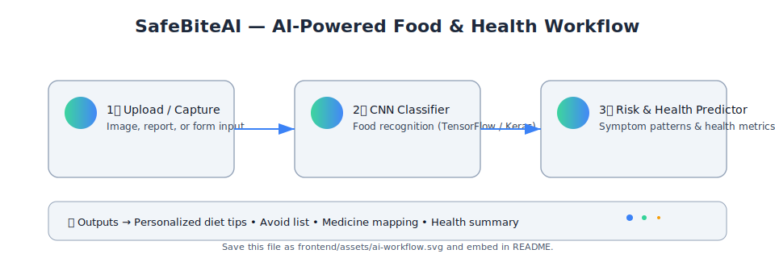

<h1 align="center">🤖 SafeBiteAI 🍽️</h1>

  <em>Your AI-powered health and food safety companion</em> 
  

---

### 🧠 About the Project

**SafeBiteAI** is an intelligent **food-safety and health-monitoring system** powered by AI.  
It analyzes your **food intake**, **medical data**, and **environmental factors** to predict health risks, unsafe food combinations, and dietary imbalances.

If a user gets sick and logs abnormal symptoms, the model predicts the **possible cause** based on previous food history — helping them **avoid harmful food or combinations** in the future.  
It also keeps track of the user's **weekly health metrics** like blood sugar and electrolyte balance — essential indicators of body regulation.  
Additionally, the system can **read and track medical reports** (uploaded via form or OCR scan) for holistic health monitoring.

---

### ⚙️ Tech Stack

| Layer | Technologies |
|-------|---------------|
| 🖥️ **Frontend** |    |
| ⚙️ **Backend** |   |
| 🤖 **AI/ML** |    |
| 🌠**APIs** |    |

---

### 🔄 Workflow Overview

<!-- 

  

 -->

  

---

### 🧩 Key Features

- 🍱 **Meal + Symptom Logging** — Tracks what you eat and how you feel.
- 🤖 **AI Analysis (TensorFlow/Keras)** — Learns from your data and predicts causes of illness.
- 🧬 **Health Metric Estimation** — Calculates patterns like blood sugar or electrolyte balance.
- 📄 **Medical Report Integration** — Uses OCR to extract health data from reports.
- ⚙️ **FastAPI + MongoDB Backend** — Secure, scalable, and fast.
- 🌐 **Smart Insights Dashboard** — Interactive frontend built with React + Tailwind.
## 📦 Dataset
The Food-101 dataset is not included in this repository due to its large size.
Download it manually from [Food-101 official site](https://data.vision.ee.ethz.ch/cvl/food-101.tar.gz)
and extract it under the project root as:
food-101/

---

