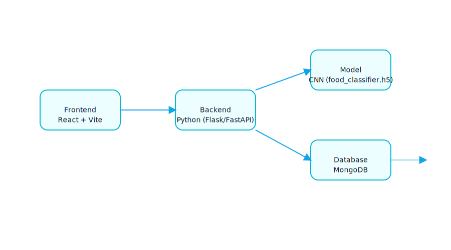

# SAFEBITE 2.0 Documentation

Welcome to the documentation for **SAFEBITE 2.0** — an AI-powered food recognition and nutrition assistant.

This documentation covers:
- System architecture overview
- Backend setup and APIs
- Frontend setup and development
- Usage guide

---

  

## Directory
- [Architecture](architecture.md)
- [Backend Setup](setup_backend.md)
- [Frontend Setup](setup_frontend.md)
- [Usage Guide](usage.md)
